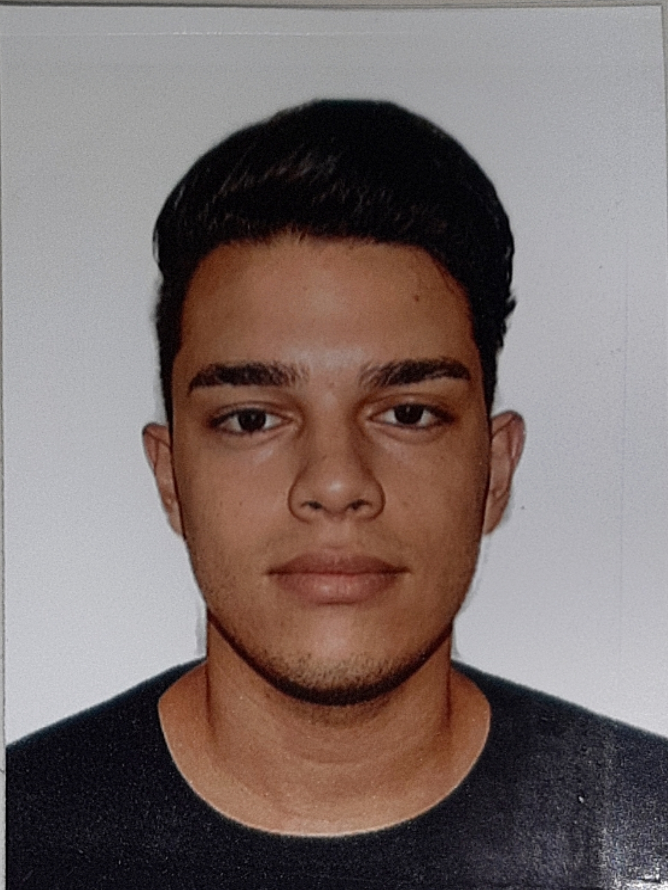

<html lang="pt-BR">
    <head>
    <title>Meu currículo</title>
        <meta charset="utf-8">
        
        <meta name="author"   content="Ranielle Santos">
        <meta name="generator" content="Brackets">
        <meta name="description" content="Currículo">
        
        
        
        
        

</head>
    <body>
        
        
        
        
        <hgroup>
        
         
         
        <h1> Ranielle da Silva Santos</h1>
         
         
         
         
        
     
· Meu interesse pelo sistema de informação surgiu desde a primeira vez que usei um desktop, 
        sempre tive aquele interesse em saber como tudo funciona atrás dos Sitemas Operacionais e programas, 
        por esse motivo escolhi fazer sistema de informação. Busco uma vaga no mercado onde posso colocar 
        minhas habilidades em prática e colaborar com equipes de trabalho, tendo o crescimento da organização 
        e o desenvolvimento pessoal e profissional como focos principais. Ademais, acredito que minhas qualidades 
        pessoais se enquadram ao perfil da empresa, além de estar disposto a me esforçar para me enquadrar ao 
        nível de profissional almejado. 

            </hgroup>
        
         
         
        
    <h3>Educação</h3>
        
• Graduação em Sistema de Informação

               
 <b>CURSANDO – 3° PERÍODO | ATUAL | FACTHUS – FACULDADE DE TALENTOS HUMANOS – PERÍODO NOTURNO</b>

         
         
        
        
• Ensino médio 

                
<b>COMPLETO | 2016 | ESCOLA ESTADUAL MINAS GERAIS</b>

        
         
         
        
        
• Curso Online

        
<b>Udemy - Curso Desenvolvedor Web Completo | 2020 </b>

        
         
         

        
• Informática

        
<b>Avançado</b>

        
         
         
        
    <h3>Experiência</h3>
        
<b>Editor Fotográfico | Neptuno Eventos |</b> 02/04/2018 – 22/05/2020

        
        
<b>Adobe Photoshop - 4 anos

        
<b>Adobe Premiere Pro - 3 anos

        
<b>Adobe Lightroom Classic - 4 anos

        
     
     
    
    <h3>Contato</h3>
    
 E-mail: raniellessantos@gmail.com

    
 Celular: (34) 98719-4770 

    
        
        
</body>
    
</html>
